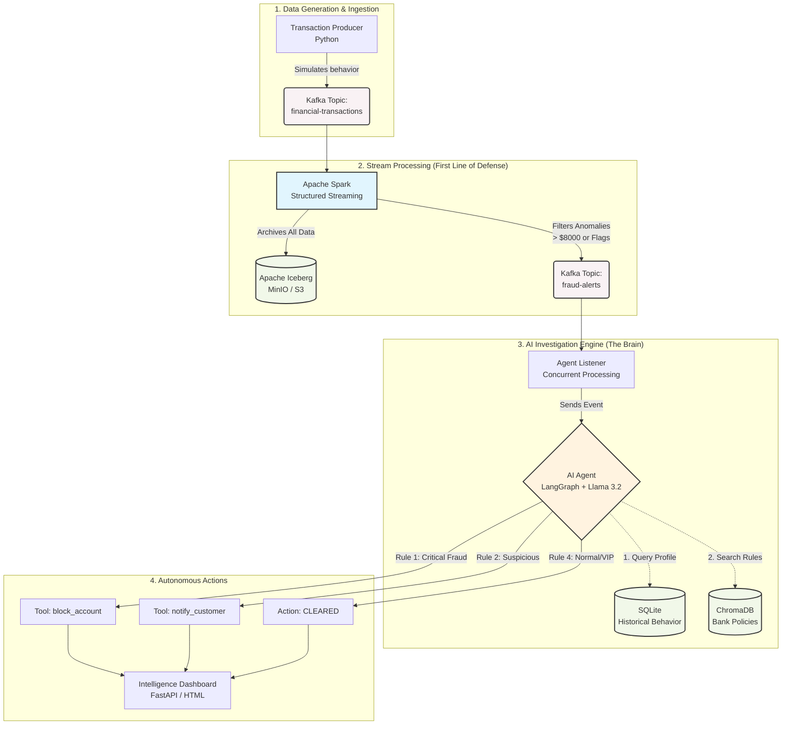

# 🛡️ Fraud Guard: AI-Powered Financial Crime Detection

## 1. Project Overview
This project implements an automated, real-time **Anti-Money Laundering (AML) and Fraud Detection Pipeline**. The system processes high-velocity financial transactions, leveraging a modern Lakehouse architecture for data storage and a localized, autonomous AI Agent for intelligent threat mitigation.

**Why this project?**
*   **Real-Time Protection**: Intercepts and evaluates transactions within seconds of them occurring on the Kafka stream.
*   **Modern Data Stack (Lakehouse)**: Utilizes Apache Spark and Apache Iceberg on MinIO (S3-compatible storage) to maintain a highly performant, ACID-compliant historical record of all transactions.
*   **Autonomous AI**: Moves beyond rigid, traditional static rule engines. It uses an LLM (Llama 3.2 via Ollama and LangGraph) to intelligently query user histories, read banking policies via RAG, and execute physical tools (like blocking accounts).
*   **Deterministic Safety**: Employs a strict **Hierarchical Decision Framework** to guarantee the AI does not hallucinate punitive actions against legitimate VIP users.

## 2. System Architecture
The project follows a robust streaming ELT pattern combined with an Event-Driven AI architecture.



## 3. Project Structure & Environment
The directory is structured to ensure seamless separation of infrastructure, streaming jobs, and AI logic:

```text
fraud-guard-pipeline/
│
├── infra/
│   └── docker-compose.yml               # Multi-container orchestration (Kafka, Spark, MinIO, Iceberg)
│    
├── src/
│   ├── pipeline/
│   │   ├── producer.py                  # Generates synthetic transactions & injects fraud
│   │   └── streaming_job.py             # Spark Structured Streaming (Writes to Iceberg & Kafka)
│   │
│   ├── agents/
│   │   ├── agent.py                     # LangGraph AI Agent, Tools, and Decision Logic
│   │   └── agent_listener.py            # Consumes 'fraud-alerts' and triggers the AI concurrently
│   │   
│   └── utils/                           # Telemetry and logging helpers
│       
├── data/                                # Local SQLite DBs, ChromaDB vectors, and config
├── web/                                 # Intelligence Dashboard (FastAPI / HTML)
├── requirements.txt                     # Python dependencies
└── start_pipeline.py                    # Master script to launch Python processes
```

## 4. Key Features

### Lakehouse Integration (Fully Local)
*   **Apache Iceberg**: All raw transactions are appended to an Iceberg table hosted on MinIO. This creates a scalable, time-travel-capable "Bronze/Silver" layer for regulatory auditing.
*   **Local S3 Emulation**: By strictly configuring Spark's S3A file system to use `Path-Style Access` and dummy credentials, enterprise-grade Lakehouse tech runs seamlessly on a local Docker network without AWS accounts.

### Intelligent Investigation (The AI Agent)
Instead of just blocking based on thresholds, the AI utilizes **Tools** to investigate context:
*   **`query_transactions`**: Executes a real SQL query to pull a user's behavioral profile (Velocity, Historical Averages, Pass-Through risks).
*   **`search_policy` (RAG)**: Connects to a ChromaDB vector store to look up textual bank guidelines when numerical data alone isn't enough.

## 5. The AI Decision Framework
To prevent "Weird Blocks" (e.g., the AI hallucinating or blocking a VIP user for a legitimate large transfer), the LLM prompt is strictly engineered as a **Hierarchical Priority List**. It must evaluate rules top-down:

1.  **CRITICAL FRAUD (High Priority)**
    *   *Trigger*: Smurfing Flags > 3 **OR** Pass-Through/Mule Risk is HIGH.
    *   *Action*: The agent **MUST** call `block_account`.
2.  **SUSPICIOUS ACTIVITY (Medium Priority)**
    *   *Trigger*: Exact round numbers (e.g., $5000) **AND** user is standard retail (not VIP).
    *   *Action*: The agent **MUST** call `notify_customer` (No funds are frozen).
3.  **AMBIGUOUS POLICY (Research Phase)**
    *   *Trigger*: Complex edge cases.
    *   *Action*: Agent calls `search_policy` to find a precedent before deciding.
4.  **NORMAL / SAFE (Default Fallback)**
    *   *Trigger*: Rules 1 and 2 do not match.
    *   *Action*: The agent clears the transaction (`[CLEARED]`). It explicitly understands that high amounts alone are not fraud.

## 6. Installation & Setup

**Prerequisites**
*   **Docker and Docker Compose** installed.
*   **Python 3.10+** installed locally.
*   **Ollama** installed on your host machine with the `llama3.2` and `all-minilm` (for embeddings) models pulled (`ollama run llama3.2`, `ollama pull all-minilm`).

**Installation Steps**
1.  **Clone the Repository** and navigate to the folder.
2.  **Install Python Dependencies**:
    ```bash
    pip install -r requirements.txt
    ```
3.  **Spin Up Infrastructure**:
    Start the Kafka broker, Zookeeper, MinIO, Iceberg REST Catalog, and Spark clusters.
    ```bash
    cd infra
    docker-compose up -d
    cd ..
    ```
    *Wait a minute for Kafka and Spark to fully initialize.*

## 7. How to Use & Monitor

1.  **Launch the Pipeline**
    Start the main orchestrator script. This will fire up the Transaction Producer, the Spark Streaming Job, the AI Agent Listener, and the Web Dashboard.
    ```bash
    python start_pipeline.py
    ```
    *(Note: If you run into a Spark `SparkConcurrentModificationException`, ensure you only have ONE instance of the Spark job running at a time).*

2.  **Monitor the Terminal**
    Watch the terminal output as transactions flow. You will see:
    *   `[PRODUCER]` generating raw logs.
    *   `[SPARK]` filtering anomalies.
    *   `[AGENT]` actively querying databases and making `[BLOCKED]` or `[CLEARED]` decisions based on the Hierarchical Framework.

3.  **View the Intelligence Dashboard**
    Open your browser to the local FastAPI server (typically `http://localhost:8000` or open `web/index.html` directly) to see real-time visualization of total transactions, blocked threats, and the AI's investigation summaries.